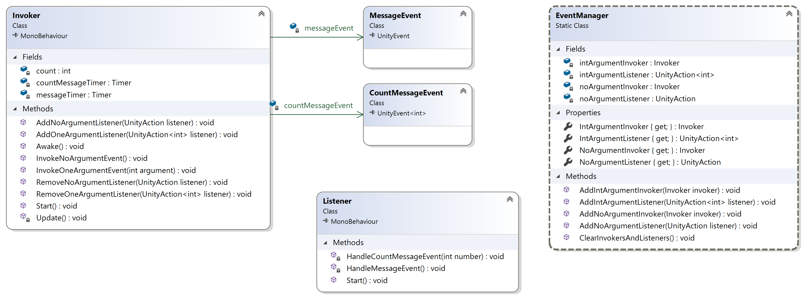

# managing-events
Marked Programming Assignment 3 of the "Intermediate Object-Oriented Programming for Unity Games" course of the "C# Programming for Unity Game Development" Specialization by the University of Colorado via Coursera Description

## Description
For this assignment, you need to implement all the classes as shown in the class diagram below:

The Unity materials I provided to you contains stubs for the **Invoker**, **Listener**, and **EventManager** classes, but you still have lots of work to do to finish implementing those classes (scripts). You also need to create and implement the **MessageEvent** and **CountMessageEvent** scripts.

In the class diagram above, the arrow (called an association) from the **Invoker** class to the **MessageEvent** class indicates that the **Invoker** class has a **MessageEvent** field named **messageEvent**.

Create a **MessageEvent** script that inherits from **UnityEvent** and create a **CountMessageEvent** script that inherits from UnityEvent<**int>**. Remember, **UnityEvent** and UnityEvent**<>** are in the UnityEngine.**Events** namespace.

In the **EventManager** script I provided, add code to the **AddNoArgumentInvoker** and **AddNoArgumentListener** methods to make the appropriate modifications to the provided **noArgumentInvoker** and **noArgumentListener** fields.

In the **Invoker** script I provided, declare fields for a **Timer** object and a **MessageEvent** object. Add code to the **Awake** method to create an instance of the **MessageEvent** object in that field. Add code to the **AddNoArgumentListener** method that adds a **UnityAction** delegate as a listener for the **MessageEvent**; remember, **UnityAction** is in the UnityEngine.**Events** namespace. Add code to the **Start** method to add the **Invoker** as a no argument invoker in **theEventManager**, add a Timer component, set its duration to 1 second, and run the timer. Add code to the **Update** method to check if the timer has finished; if it has, call the **InvokeNoArgumentEvent** method and run the timer again. Add code to the **InvokeNoArgumentEvent** method to invoke the **MessageEvent**.

In the Unity editor, attach the Invoker script to the main camera.

In the **Listener** script I provided, in the **Start** method, add code to add the **HandleMessageEvent** method as a no argument listener in the **EventManager**.

In the Unity editor, attach the Listener script to the main camera.

Run the game. The message should be printed in the Console window every second.

Follow similar steps to add event handling for the one int argument event. I just had the **Invoker** script increment the value it includes each time it invokes the event, but do whatever you want to provide a different integer each time.

## Getting Started

n/a

### Dependencies

* Windows 10
* Microsoft Visual Studio
* .NET
* Unity

### Installing

* Download link: [Github Repository](https://github.com/lyndonpanton/managing-events)

### Executing program

n/a

## Help

n/a

## Authors

Lyndon Mykal Panton
[lyndonpanton](https://github.com/lyndonpanton/)

## Version History

* 0.1
    * Initial Release

## License

n/a

## Acknowledgments

Problem provided by the _University of Colorado_ and _Coursera_
